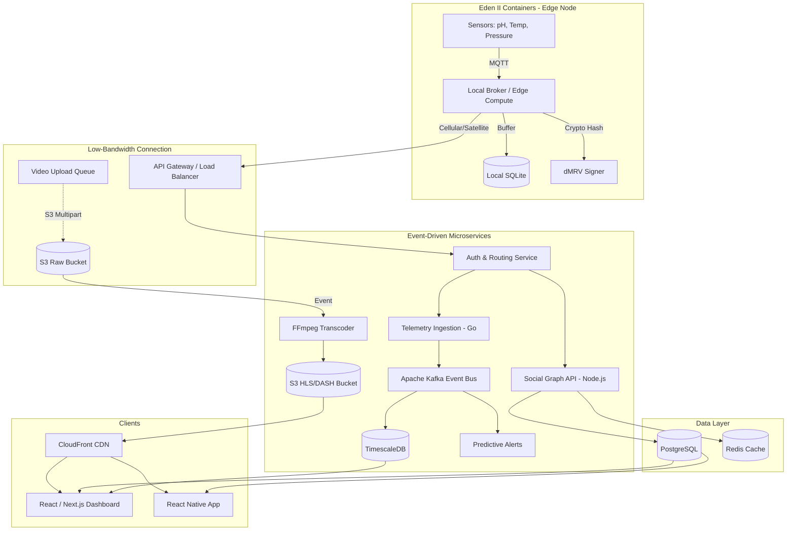

# Architectural Design Document (ADD)
## NexusLIMS & Feeders of the World

### 1. Enterprise Tech Stack Selection

#### 1.1 The Edge Node (Eden II Containers)
*   **Languages:** Rust (for performance, memory safety, and low resource footprint) or C++14/17. Python for high-level orchestration/ML inference if hardware permits.
*   **Messaging:** MQTT (Mosquitto) for local sensor pub/sub.
*   **Local Storage:** SQLite or DuckDB for robust time-series buffering during offline periods.
*   **Security/dMRV:** Ed25519 cryptographic signatures generated in a hardware secure module (HSM) or TPM to hash telemetry data for immutable Voluntary Carbon Market (VCM) credits.
*   **Orchestration:** K3s (Lightweight Kubernetes) or AWS IoT Greengrass for OTA updates and container management.

#### 1.2 The Cloud Backend
*   **Microservices Framework:** Go (Golang) for high-throughput telemetry ingestion and asynchronous sync handling; Node.js (NestJS) for the social graph and GraphQL federation.
*   **Communication:** gRPC for internal service-to-service communication; GraphQL for frontend clients (reduces over-fetching on low-bandwidth connections).
*   **Infrastructure:** Dockerized services running on Kubernetes (EKS/GKE) with cluster autoscaling.

#### 1.3 The Data Layer
*   **Relational Data:** PostgreSQL (Aurora or CockroachDB for multi-region replication) for users, social graph, and sister-link pairings.
*   **Time-Series Data:** TimescaleDB or InfluxDB for high-frequency hardware telemetry.
*   **Caching & Queues:** Redis for real-time leaderboards and rate limiting; Apache Kafka for event-driven stream processing (telemetry anomalies, predictive maintenance).

#### 1.4 The Media Pipeline
*   **Ingestion:** AWS S3 with Multipart Uploads (allows byte-range pausing/resuming, crucial for unreliable 3G/satellite connections).
*   **Transcoding:** AWS Elemental MediaConvert or a cluster of Spot Instances running FFmpeg to transcode high-res uploads into adaptive bitrates (HLS/DASH) at various resolutions (e.g., 144p to 1080p).
*   **Delivery:** CloudFront CDN for global, edge-cached video delivery.

#### 1.5 The Frontend
*   **Mobile (Farmers/Field):** React Native or Flutter. Must include local-first architecture (e.g., WatermelonDB) to allow offline video queueing and viewing cached agronomy exchanges.
*   **Web (Command Center):** React with Next.js (SSR for SEO on public forums, CSR for dashboards) using Tailwind CSS for a dense, data-rich enterprise interface.

---

### 2. System Architecture Diagram



---

### 3. Database Schema Design (Prisma)

```prisma
generator client {
  provider = "prisma-client-js"
}

datasource db {
  provider = "postgresql"
  url      = env("DATABASE_URL")
}

enum Role {
  COMMERCIAL_GROWER
  COOPERATIVE_MANAGER
  AGRONOMIST
}

model User {
  id        String   @id @default(uuid())
  role      Role
  name      String
  location  String
  createdAt DateTime @default(now())

  hardwareNodes HardwareNode[]
  mediaPosts    MediaPost[]
}

model HardwareNode {
  id          String   @id @default(uuid())
  ownerId     String
  status      String   @default("OFFLINE")
  firmwareVer String
  createdAt   DateTime @default(now())

  owner             User                @relation(fields: [ownerId], references: [id])
  telemetryLogs     TelemetryLog[]
  asCommercial      SisterLink[]        @relation("CommercialLink")
  asCooperative     SisterLink[]        @relation("CooperativeLink")
}

model SisterLink {
  id                String   @id @default(uuid())
  commercialNodeId  String
  cooperativeNodeId String
  establishedAt     DateTime @default(now())

  commercialNode  HardwareNode @relation("CommercialLink", fields: [commercialNodeId], references: [id])
  cooperativeNode HardwareNode @relation("CooperativeLink", fields: [cooperativeNodeId], references: [id])
}

model TelemetryLog {
  id            String   @id @default(uuid())
  nodeId        String
  timestamp     DateTime
  phLevel       Float?
  pressureBar   Float?
  temperatureC  Float?
  hashSignature String   // For dMRV verification

  node       HardwareNode @relation(fields: [nodeId], references: [id])
  mediaPosts MediaPost[]

  @@index([nodeId, timestamp(sort: Desc)]) // Optimized for time-series queries
}

model MediaPost {
  id                  String   @id @default(uuid())
  authorId            String
  videoUrl            String
  thumbnailUrl        String
  description         String?
  telemetrySnapshotId String?
  createdAt           DateTime @default(now())

  author            User          @relation(fields: [authorId], references: [id])
  telemetrySnapshot TelemetryLog? @relation(fields: [telemetrySnapshotId], references: [id])
}
```

---

### 4. Core Microservice APIs

#### 4.1 Telemetry Sync Pipeline (Edge-to-Cloud)
**Endpoint:** `POST /api/v1/sync/telemetry`
**Description:** Batch ingests telemetry data. Validates the cryptographic hash to ensure data hasn't been tampered with locally before generating VCM credits.
**Request Body:**
```json
{
  "nodeId": "hw_9876",
  "batch": [
    {
      "timestamp": "2026-08-30T10:30:00Z",
      "metrics": { "ph": 6.4, "pressure": 598.2, "temp": 398.5 },
      "hashSignature": "a3f8c...9b12"
    }
  ]
}
```
**ACID Compliance:** Backend uses a distributed transaction (Saga pattern or direct DB transaction) to ensure telemetry is written to TimescaleDB and the dMRV ledger is updated atomically.

#### 4.2 Video Upload Pipeline
**Endpoint 1: Init Upload** `POST /api/v1/media/upload/init`
**Description:** Generates a presigned URL for S3 multipart upload. Allows the edge node to upload chunks as bandwidth becomes available.
**Response:** `{ "uploadId": "xyz", "parts": [ { "partNumber": 1, "url": "https://s3..." } ] }`

**Endpoint 2: Finalize Upload** `POST /api/v1/media/upload/finalize`
**Description:** Triggers the FFmpeg transcoding job via Kafka event once all parts are uploaded. 

#### 4.3 Sister-Link Feed Retrieval
**Endpoint:** `GET /api/v1/feed/sister-link?userId=123&page=1`
**Description:** Retrieves a paginated list of media posts from the user's Sister-Link network, joined with the exact telemetry snapshot that occurred at the time of the recording.
